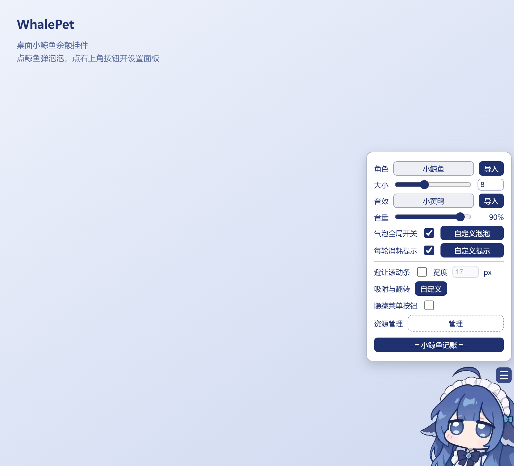

# WhalePet

把 DSH 的小鲸鱼余额挂件搬到桌面上，做成一个独立小程序。



程序里跑的就是插件本体，所以插件有的功能它都有：导入自己的角色图和音效、模块化泡泡（文字 / 余额 / 今日 / 峰谷 / 图片动图）、吸附与翻转、点鲸鱼推进台词队列、多厂商余额与额度、Codex 用量统计、小鲸鱼记账。插件更新时，换掉插件文件重新打包即可，不用改外壳代码。

## 下载

到 [Releases](https://github.com/CherieHana/Boom/releases) 下载 `WhalePet-1.0.0.zip`，解压后双击 `WhalePet.exe`。不用装 Python、Node 或 Qt。

系统要求是 64 位 Windows 10 1809+ 或 Windows 11。第一次启动要解压内置运行时，大概 5～10 秒，之后每次约 5 秒。

## 用法

- 首次启动会让你填 DeepSeek API Key，只保存在本机（`%APPDATA%\WhalePet`），不会上传。
- 点小鲸鱼弹泡泡，右键或右上角那个按钮打开设置面板。角色、音效、泡泡内容、吸附方式、记账都在面板里改。
- 想让别的客户端的用量也出现在「每轮消耗」里，把那个客户端的 `base_url` 指到 `http://127.0.0.1:11434/v1`。端口可以在托盘菜单的「设置」里改。
- 想把整个文件夹拷到别的电脑继续用，就在 exe 旁边放一个空的 `portable.flag`，数据会存进同级的 `WhalePetData\`。

## 常见问题

| 现象 | 原因与处理 |
| --- | --- |
| 启动慢 | 单文件每次启动都要把内置运行时解压到临时目录，这是打包方式的代价。想更快可以自己用 `pyinstaller --onedir` 打成文件夹版 |
| 杀软报毒 | PyInstaller 加内嵌 Node 的组合常被误报，加白名单即可。源码与构建脚本都在这个仓库里，可以自己复核后再打包 |
| 余额显示为空 | 先确认 Key 有效；面板里的「测试连通性」会把接口返回的错误显示出来 |
| 多显示器 | 覆盖层目前只铺主显示器，多屏还没做 |

## 它是怎么工作的

- exe 里带一个 Node 进程跑插件本体（`vendor/dsh-whale-widget/lib/index.js`），QtWebEngine 在透明置顶窗口里加载挂件页面。
- 窗口按挂件「当前可见的区域」设置遮罩，于是鲸鱼和展开的面板可以点，其余位置点击直接落到桌面。
- 插件需要三个宿主服务（`webServer`、`credentials`、`connection`）和会话事件，这些由 `host/host.mjs` 提供；它同时对外提供假 DSH 页面和 `/__host/*` 接口。
- 桌面版没有 DSH 的会话事件，「每轮消耗」由内置的本地中转从 API 响应的 `usage` 里合成事件喂给插件。

具体实现和取舍都写在 `src/whalepet/` 的注释里。

## 从源码构建

```powershell
.\scripts\sync-plugin.ps1     # 拉取插件本体到 vendor\dsh-whale-widget（插件不入库）
.\scripts\fetch_node.ps1      # 下载 Node LTS 到 runtime\node\node.exe（走国内镜像）
.\build.ps1                   # 生成 payload.zip、图标与 dist\WhalePet.exe
.\build-dist.ps1              # 构建 + 分发校验 + dist\WhalePet-<版本>.zip
```

调试和测试：

```powershell
.\.venv\Scripts\python.exe -m pytest tests -q      # 单元测试 + 宿主集成测试（需要 node）
.\.venv\Scripts\python.exe scripts\smoke_app.py    # 源码态端到端冒烟
$env:WHALE_PET_SELFCHECK=1
.\.venv\Scripts\python.exe scripts\smoke_exe.py    # 打包产物冒烟，含「挂件是否真的渲染」自检
```

想换 README 里的截图，跑 `scripts\make_screenshot.py`，它会用无头浏览器渲染一张干净的图。

## 插件升级

```powershell
.\scripts\sync-plugin.ps1     # 拉上游最新插件，覆盖 vendor\dsh-whale-widget
# 改 src\whalepet\__init__.py 里的 PLUGIN_VERSION
.\build-dist.ps1              # 重新打包
```

外壳只按三件事跟插件对接：要提供的 ctx 服务、`assistant/message` 会话事件、插件自己注册的 `/dsh-whale/*` 路由。插件加路由或加字段一般不用动外壳代码，改完跑一遍测试就知道。

## 数据目录

| 情况 | 位置 |
| --- | --- |
| 默认 | `%APPDATA%\WhalePet\` |
| exe 同级有 `portable.flag` 或 `config.json` | `exe同级\WhalePetData\` |
| 设了环境变量 `WHALE_PET_DATA` | 指定的目录 |

目录里有：`config.json`（外壳配置）、`dsh-home\`（插件自己的状态，包括 `.dshw-size.json`、`.dshw-usage.json`、`credentials.json`、`whale-roles\`、`whale-audio\`）、`runtime\<版本戳>\`（解包后的 Node 与插件）、`webengine\`（挂件位置等持久化数据）、`logs\`。

## 从旧的 Qt 版桌宠迁移

旧版的 `config.json`、`ledger.json`、`phrases.json` 和新版在同一个目录，首次启动时程序会：

1. 把这三个文件各备份一份为 `*.pre-v030.bak`；
2. 把旧配置里的键（api_key、proxy_*、scale、volume、sound_set、peak_mode、usage_mode、预警阈值等）合并进新配置，并写成插件的 `.dshw-size.json`；
3. 把旧账本的 `history`（`{day: {usage, models}}`）转成插件要的格式，保证「今日已用 / 近 7 天」不归零；
4. 把 api_key 写进插件密钥库的 `DEEPSEEK_API_KEY`。

迁移只跑一次，只增不删。旧版 exe 建议留着，随时能回退。

## 发布成品

`build-dist.ps1` 产出的 zip 里有 `WhalePet.exe`、使用说明、README 和插件的 MIT 许可。打包前 `scripts\verify_dist.py` 会检查产物里没有 `sk-` 形式的密钥、没有你本机在用的 API Key、没有本机用户名，`payload.zip` 里也没有任何个人数据。

可执行文件通过 GitHub Release 分发，仓库里只放代码。对方拿到 zip 解压就能跑，API Key 和账本都由对方自己产生。

## 许可与致谢

- 这个仓库的代码（`src/`、`host/`、`scripts/`、构建脚本）是 MIT，见 `LICENSE`。
- 挂件本体与角色图、音效等素材来自 [MeteorNOX/DeepSeek-Balance-Whale-Widget](https://github.com/MeteorNOX/DeepSeek-Balance-Whale-Widget)（MIT），由 `scripts\sync-plugin.ps1` 在构建时获取，不随仓库分发。素材版权归原作者及各自权利人。
- 本项目是个人作品，与 DeepSeek、DSH、Codex 官方无关；余额和用量只走你自己填写的接口，配置与密钥都留在本机。
